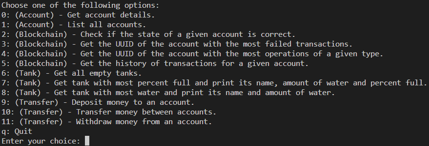

* [General info](#general-info)
* [Setup](#setup)
* [Application view](#application-view)

## General info
<details>
<summary>I created a Python class, 'Tank,' that simulates water tanks with name and capacity attributes. It includes methods for adding, removing, and transferring water while respecting capacity limits. The class also tracks operation history with timestamps, operation names, tanks involved, water volumes, and success status. I added functions to find tanks with the most failed operations and tanks with the most of a specific operation type. This project showcases 'Event Sourcing' principles, ensuring water state consistency with recorded operations.</summary>
</details>


## Setup
1. Clone the repo
```git clone https://github.com/WebbErrJF/market_tracker.git```

2. Go to the project's directory.

3. Run:
```pipenv install```

4. Run:
```export PYTHONPATH=$PWD```

## Application view
<h3>Menu</h3>




<h3>Deposit</h3>


<h3>Get all transactions</h3>


<h3>Checking the if state is consistent</h3>
We are traversing through the blockchain linked list and checking if the state is consistent. If it is not, we are printing the block number and the state of the tanks.


